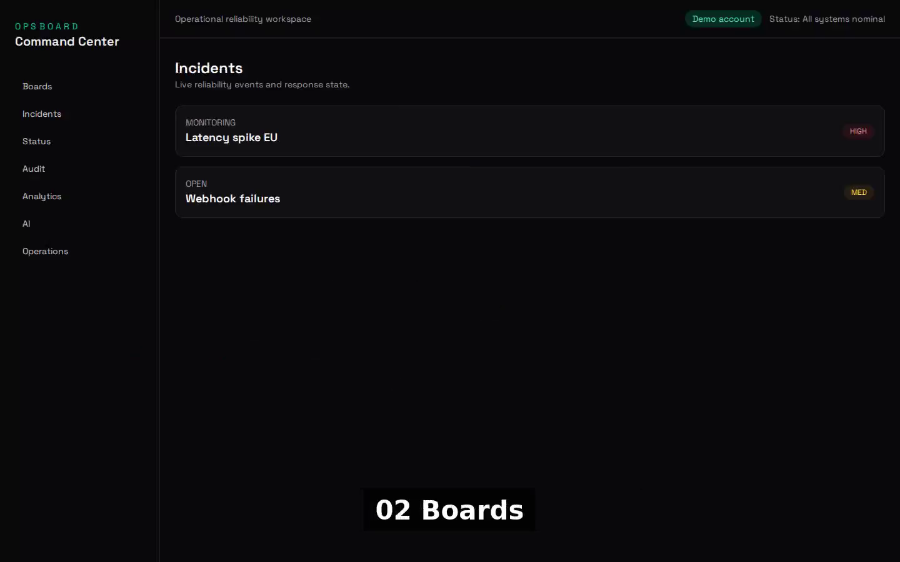
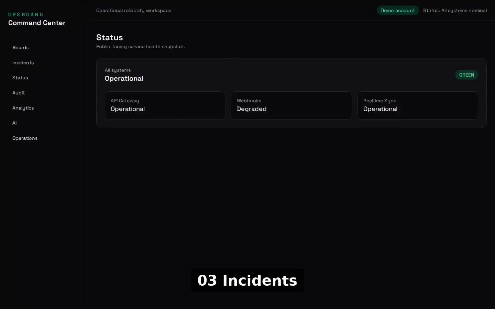
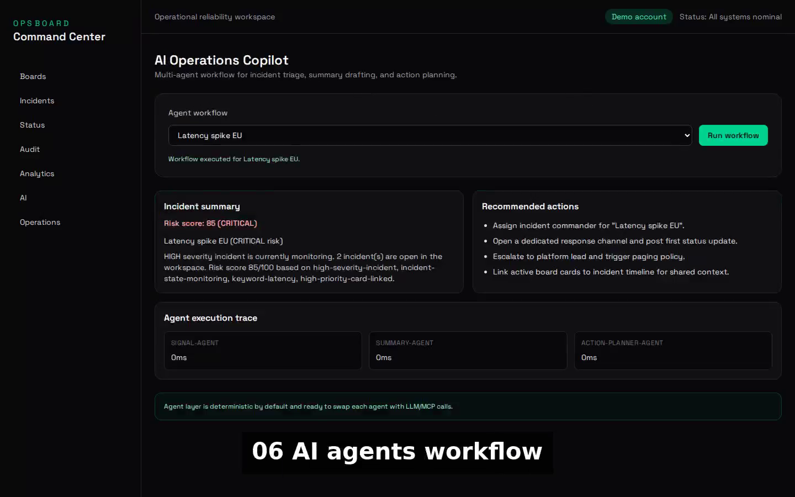
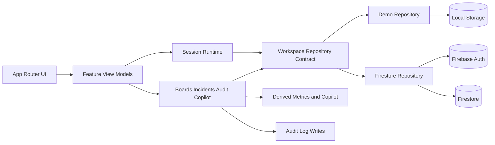

# Opsboard

**Command your work. Prove your reliability.**

Opsboard is a portfolio-grade operations workspace that combines kanban execution, incident response, service health, audit history, analytics, and a deterministic reliability copilot in one product. It is built as a production MVP, not a static dashboard demo.


## Live Demo

https://opsboard-mvp-live.web.app

## Demo Video

[](./opsboard/docs/media/opsboard-demo-captioned.mp4)

Click the preview to open the full MP4.

## Screenshots

| Boards | Incidents | Copilot |
| --- | --- | --- |
|  |  |  |

## What To Look At

If you are reviewing this as a portfolio project, the highest-signal parts are:

- the repository-backed split between `demo` and `authenticated` runtime modes
- the incident lifecycle and automatic audit side effects
- the deterministic copilot that derives recommendations from live workspace state
- the Firestore security rules and end-to-end workflow coverage

## Product Scope

Opsboard v1 is designed as a `single-user operational workspace` with:

- Google sign-in for authenticated mode
- starter workspace bootstrap on first login
- isolated per-user Firestore persistence under `users/{uid}/...`
- explicit demo mode for instant evaluation without authentication
- deterministic copilot logic that works without an external LLM
- audit-first write flows for incidents and operations actions

## Core Features

### Boards

- Live kanban board backed by repository-driven data
- Create cards directly in the workspace
- Move cards between lists with persistent state
- Shared board model for demo and authenticated runtime modes

### Incidents

- Create incidents from the UI with severity and summary
- Move incidents through `open`, `monitoring`, and `resolved`
- Automatic audit events on incident creation and state transitions

### Status

- Service health view derived from live workspace services
- Overall workspace health calculated from incidents and service state

### Audit

- Live audit timeline sourced from the active workspace
- Richer event rendering with action details and actor metadata

### Analytics

- Derived workspace metrics for cards, incidents, audit volume, and uptime
- No seed-only dashboard logic in app routes

### Deterministic Copilot

- Deterministic risk scoring over live incidents, cards, services, and audit history
- Summary, action plan, and execution trace without external AI dependencies

### Operations Readiness

- Local telemetry and recovery snapshot controls
- Workspace-aware audit writes for operations actions

## Architecture

The app keeps routes thin and pushes behavior into feature and repository layers.

- `opsboard/src/app`
  Route entrypoints and page composition
- `opsboard/src/features`
  Session, boards, incidents, analytics, status, workspace, audit, and copilot logic
- `opsboard/src/features/data/repositories`
  Demo and Firestore adapters behind shared contracts
- `opsboard/src/components`
  UI for boards, incidents, analytics, audit, auth, AI, and operations

Runtime is explicitly split into:

- `demo`
  Local demo repository with persistent browser storage
- `authenticated`
  Firebase Auth + Firestore-backed workspace for the signed-in user



## Tech Stack

| Category | Technologies |
| --- | --- |
| Frontend | Next.js 16 App Router, React 19, TypeScript 5 |
| Styling | Tailwind CSS 4 |
| Auth | Firebase Auth with Google sign-in |
| Data | Firestore with per-user document paths |
| Testing | Vitest, React Testing Library, Playwright |
| Hosting | Firebase Hosting |

## Local Setup

```bash
git clone git@github.com:Patrik652/opsboard-mvp.git
cd opsboard-mvp/opsboard
npm install
```

Create an `.env.local` file in `opsboard/`:

```bash
NEXT_PUBLIC_FIREBASE_API_KEY=...
NEXT_PUBLIC_FIREBASE_AUTH_DOMAIN=...
NEXT_PUBLIC_FIREBASE_PROJECT_ID=...
NEXT_PUBLIC_FIREBASE_STORAGE_BUCKET=...
NEXT_PUBLIC_FIREBASE_MESSAGING_SENDER_ID=...
NEXT_PUBLIC_FIREBASE_APP_ID=...
```

Then run:

```bash
npm run dev
```

Open `http://localhost:3000`.

If Firebase env vars are not set, the app still supports local demo mode.

## Firebase Notes

- Google Auth must be enabled in Firebase Authentication
- Firestore is scoped with rules in [opsboard/firestore.rules](./opsboard/firestore.rules)
- User data is stored under `users/{uid}/...`

## Scripts

```bash
npm run dev
npm run build
npm run lint
npm test -- --run
npm run test:e2e
npm run deploy:firebase
```

## Verification

Latest local verification before release:

- `npm test -- --run`: `24` files, `37` tests passed
- `npm run lint`: passed
- `npm run build`: passed
- `npm run test:e2e -- --reporter=line`: `3 passed`

Live verification:

- `npm run smoke:demo`: passed against `https://opsboard-mvp-live.web.app`
- live Playwright smoke for `basic`, `demo`, and `workspace` flows: `3 passed`

## Portfolio Highlights

- Real authentication plus a separate instant demo path
- Shared repository contracts for demo and production persistence
- Deterministic copilot layer designed to be defensible and testable
- Firestore security rules included in the repo
- End-to-end workflow coverage for board, incident, and audit paths

## Repository Layout

```text
.
├── docs/
│   ├── plans/
│   └── releases/
├── firebase.json
├── opsboard/
│   ├── firestore.rules
│   ├── docs/media/
│   ├── src/
│   ├── tests/e2e/
│   └── package.json
└── README.md
```

## License

MIT
