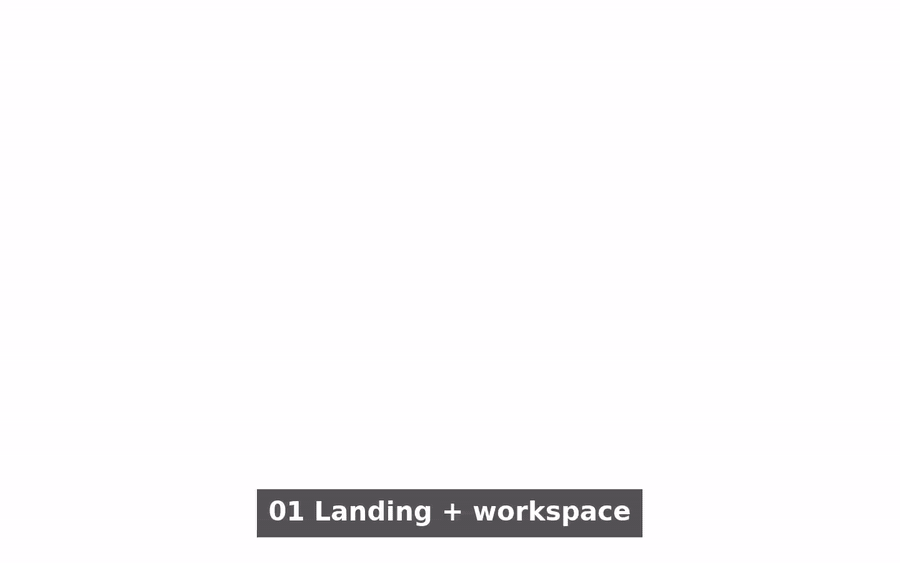

# Opsboard MVP

Opsboard is a Trello-style operations board fused with incident response, audit trails, and live metrics. It is designed to feel like a professional Ops platform while staying simple enough for a fast MVP.

Live demo: https://opsboard-mvp-live.web.app

## Demo Video

[](./docs/media/opsboard-demo-captioned.mp4)

Click the preview to open the full MP4.

## Features

- Boards + cards (Trello-style)
- Incident tracking + status page
- Audit log timeline
- Analytics dashboard
- AI ops copilot with multi-agent workflow (signal, summary, planner)
- Operations readiness panel (telemetry + audit + recovery snapshots)
- Seed demo data for a quick wow factor

## Product Flow

1) **Open demo workspace** (offline by default)
2) Optional: **Try demo account** (Firebase Anonymous Auth)
3) **Auto-seed** demo data on first login
4) Navigate **Boards → Incidents → Status → Audit → Analytics → AI**

## Tech Stack

- Next.js (App Router) + TypeScript
- Tailwind CSS
- Firebase Auth + Firestore
- Vitest + React Testing Library
- Playwright E2E

## Local Setup

```bash
npm install
npm run dev
```

Open http://localhost:3000

### Firebase Setup

Create a Firebase project and fill in `.env.local`:

```env
NEXT_PUBLIC_FIREBASE_API_KEY=...
NEXT_PUBLIC_FIREBASE_AUTH_DOMAIN=...
NEXT_PUBLIC_FIREBASE_PROJECT_ID=...
NEXT_PUBLIC_FIREBASE_STORAGE_BUCKET=...
NEXT_PUBLIC_FIREBASE_MESSAGING_SENDER_ID=...
NEXT_PUBLIC_FIREBASE_APP_ID=...
NEXT_PUBLIC_FIREBASE_ENABLE_ANON_AUTH=true
```

By default, the login CTA opens offline demo mode. Set
`NEXT_PUBLIC_FIREBASE_ENABLE_ANON_AUTH=true` and configure Firebase Auth to enable real anonymous sign-in.

Enable:
- Authentication → Sign-in method → Anonymous
- Firestore → Create database

## Tests

```bash
npm test
```

### E2E Tests

```bash
npm run test:e2e
```

Live URL smoke check:

```bash
npm run smoke:demo
```

## Build

```bash
npm run build
```

## Deploy (Firebase Hosting)

See: `opsboard/docs/firebase-hosting.md`

## Release Checklist

- [ ] Add Firebase env vars (or provide demo project)
- [ ] `npm test`
- [ ] `npm run test:e2e`
- [ ] `npm run smoke:demo`
- [ ] `npm run build`
- [ ] Deploy to Firebase Hosting or Vercel
